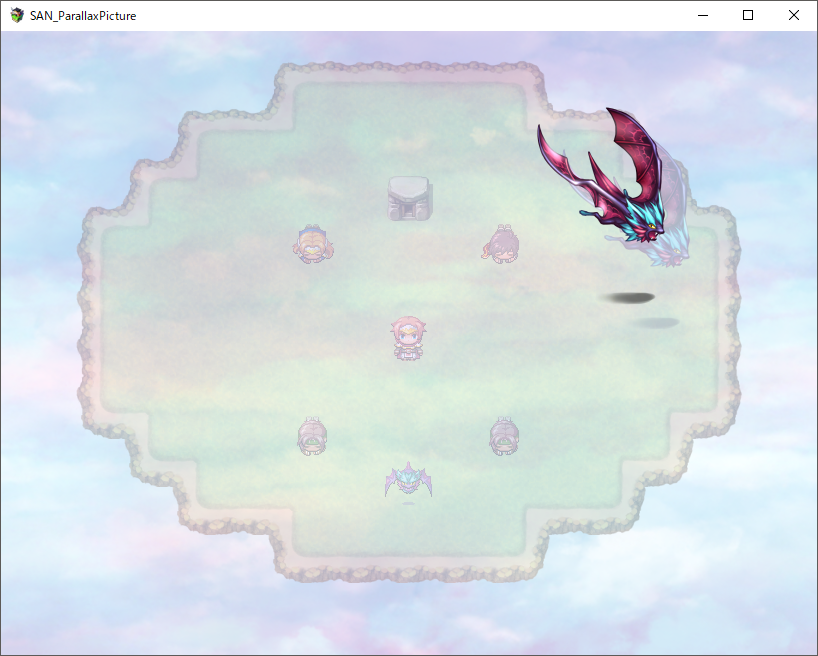
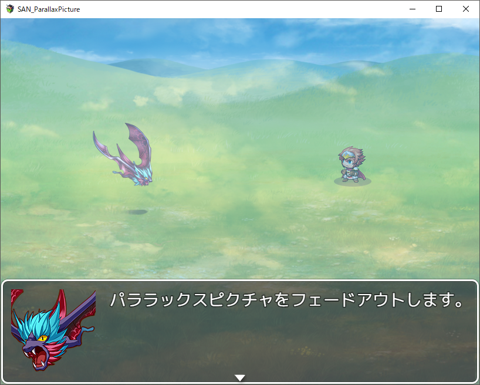

# SAN_ParallaxPicture
このスクリプトはRPGツクールMV向けプラグインです。   

## 概要
ピクチャを遠景のようにスクロール表示します。
他のピクチャとの表示前後関係の調整が可能です。   

## 使い方
次のリンク先のファイルを保存してプラグインとして適用してください。   
https://raw.githubusercontent.com/rev2nym/SAN_ParallaxPicture/master/js/plugins/SAN_ParallaxPicture.js   
詳細はプラグイン内のヘルプとサンプルプロジェクトを参考にしてください。   

## サンプルプロジェクト
次のダウンロードリンクからzipファイルをダウンロードして
展開後に新規プロジェクトに上書き保存してください。  
https://github.com/rev2nym/SAN_ParallaxPicture/archive/master.zip   

## デモ
- マップ上のパララックスピクチャ   
   

- バトル中のパララックスピクチャ   
   

##  利用規約
MITライセンスのもと、商用利用、改変、再配布が可能です。
ただし冒頭のコメントは削除や改変をしないでください。
これを利用したことによるいかなる損害にも作者は責任を負いません。
サポートは期待しないでください＞＜。  
